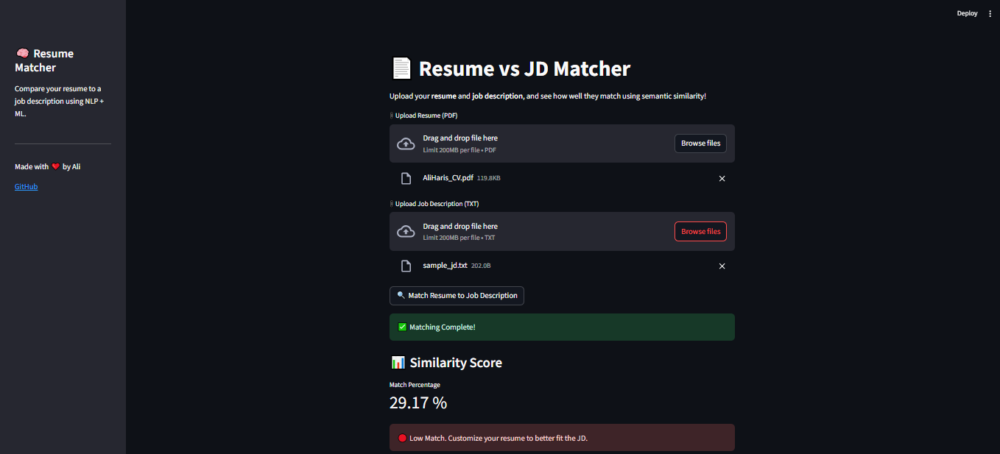
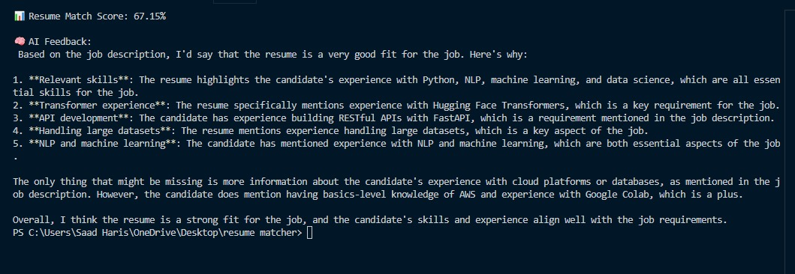

# 💼 Smart Resume Matcher

🚀 Match your resume to any job description using NLP, sentence embeddings, and cosine similarity — all wrapped inside a clean, user-friendly **Streamlit** interface.

> 📍 Built with love using Python, Hugging Face Transformers, TensorFlow, Streamlit, and more.

---

## 🧠 What It Does

This project automatically checks how well a resume matches a job description using **Natural Language Processing** techniques. It's perfect for:

- Job seekers checking if their resume fits a role
- HR teams filtering resumes
- AI developers experimenting with embeddings and similarity scoring

---

## 🛠 Features

- 📄 Upload any **PDF resume**
- 📝 Paste any **job description**
- 🔍 See your **match score**
- 🤖 Uses **sentence-transformer** embeddings under the hood
- 📊 Cosine similarity measures semantic closeness
- 🌐 Clean & interactive **Streamlit Web UI**

---

## 🧱 Tech Stack

| Tool | Purpose |
|------|---------|
| 🐍 Python | Core logic |
| 📚 PyPDF2 | PDF parsing |
| 🤗 Hugging Face Transformers | Sentence embeddings |
| 📊 TensorFlow | Backend for transformer ops |
| 🧮 Cosine Similarity | Similarity metric |
| 🌐 Streamlit | Web UI |
| 🛠 .env + dotenv | API key management |

---

## 📂 Project Structure

```

Smart-Resume-Matcher/
│
├── app/
│   ├── resume_utils.py       # PDF resume extraction logic
│   ├── jd_utils.py           # JD processing + matching logic
│   └── main.py               # Backend logic testable via console
│
├── streamlit_app.py          # Full Streamlit UI code
├── requirements.txt          # All dependencies
├── .gitignore                # To hide .env and other secrets
└── README.md                 # You're reading it

````

---

## 🚀 How It Works

### 🧾 1. Resume Parsing
```python
from PyPDF2 import PdfReader
````

* Loads your resume from a PDF
* Extracts clean, readable text
* Prepares it for semantic embedding

---

### 🧾 2. Job Description Input

You can:

* Paste in a JD manually
* Or connect it later to a live job board

---

### 🧠 3. Sentence Embedding (NLP)

```python
from sentence_transformers import SentenceTransformer
model = SentenceTransformer("all-MiniLM-L6-v2")
```

* Embeds both JD and resume into high-dimensional vectors
* Captures **semantic meaning** not just keywords

---

### 🧮 4. Cosine Similarity

```python
cosine_score = cosine_similarity(resume_embedding, jd_embedding)
```

* Gives a score between **0.0** and **1.0**
* Shows how well the two texts semantically align

---

### 🌐 5. Streamlit UI

```bash
streamlit run streamlit_app.py
```

* Upload your resume ✅
* Paste the JD ✅
* View score + summary ✅

---

## 🖥 Demo Screenshots




---

## ✅ Installation

1. **Clone this repo**

```bash
git clone https://github.com/Aliharis007/Smart-Resume-Matcher.git
cd Smart-Resume-Matcher
```

2. **Install dependencies**

```bash
pip install -r requirements.txt
```

3. **(Optional)** Set up `.env` for any API keys or secrets you add later:

```env
OPENAI_API_KEY=your-key-here
```

4. **Run the Streamlit app**

```bash
streamlit run streamlit_app.py
```

---

## 📦 Requirements

Install all required packages easily:

```txt
streamlit
PyPDF2
scikit-learn
sentence-transformers
tensorflow
python-dotenv
```

---

## 🤝 Contributing

Wanna help make this better? Fork it, add your ideas, and submit a pull request!
We 💙 collaboration.

---

## 👨‍💻 Author

Made with 💻 by [Ali Haris](https://github.com/Aliharis007)

---

**Don't forget to ⭐ the repo if you found it useful!**

```
